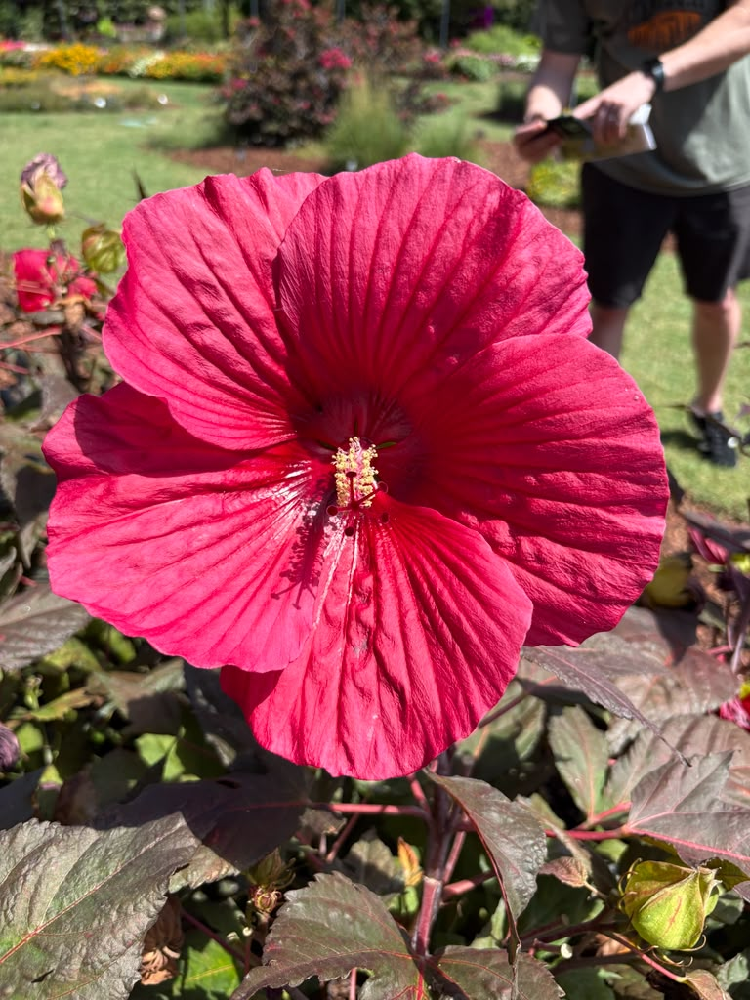
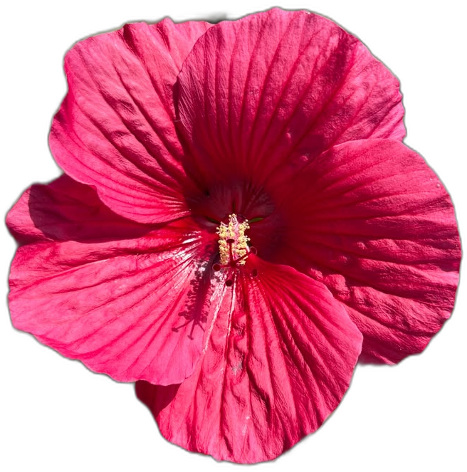
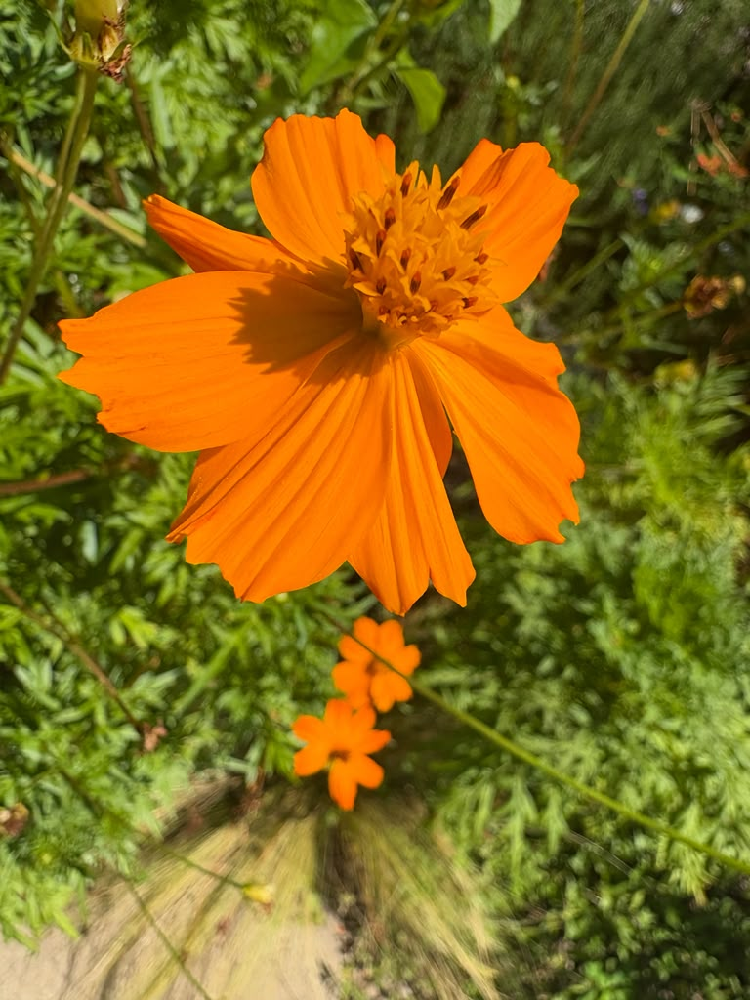
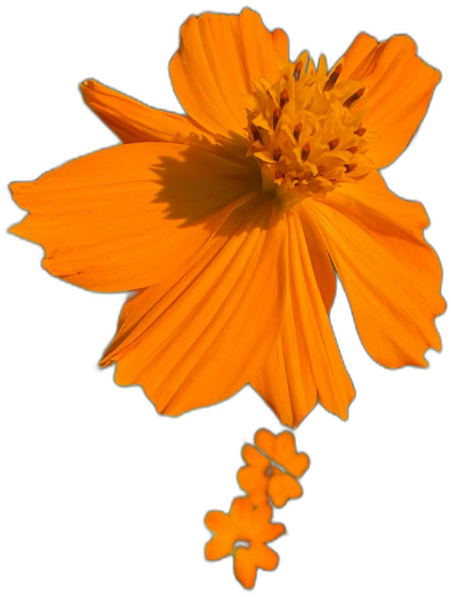
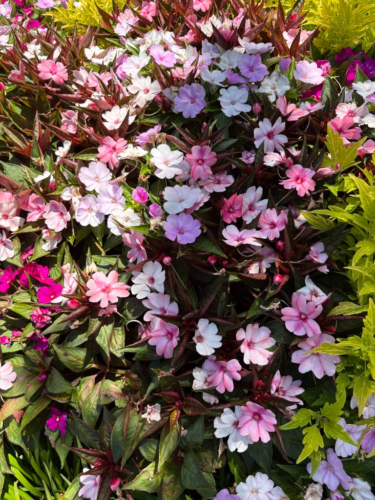
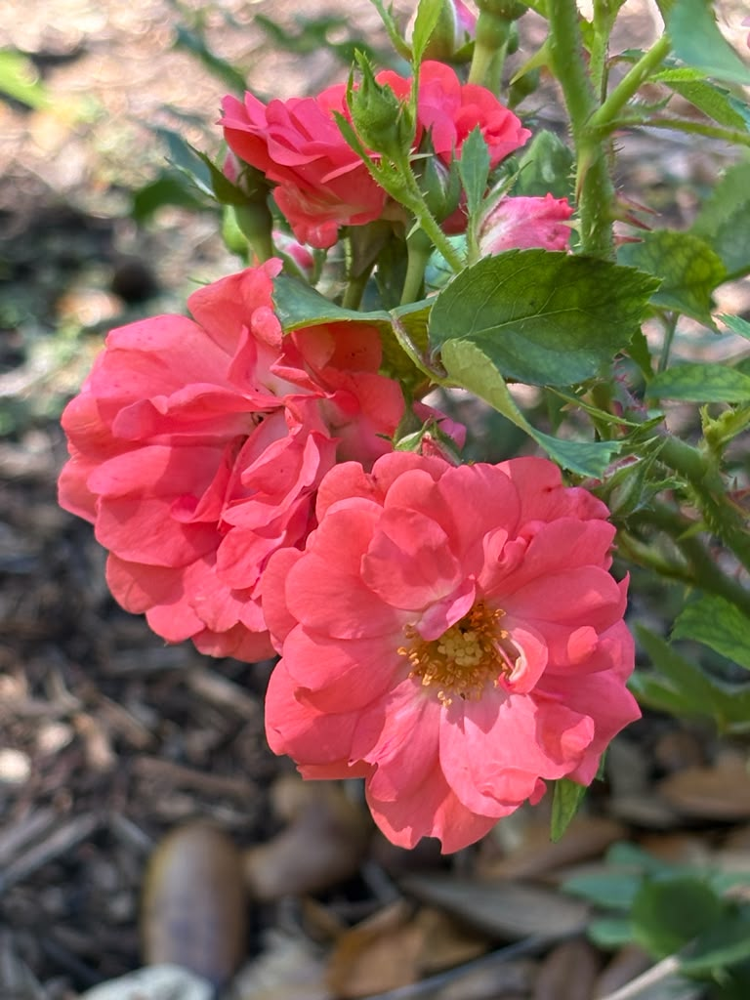
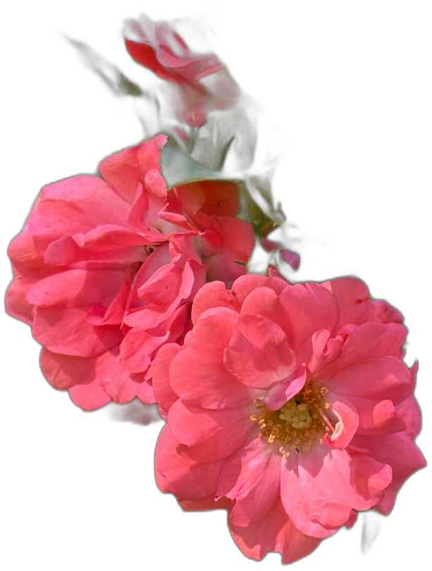

***As of 07/26/2026 git commit:***

*flowers_raw* - raw flower photos from iphone (JPEG)

then set up virtual environment and activate

run: *pip install -r requirements.txt*

then run: *main.py*

if "1" is selected:

- *image_pull* - ouputs objects (flowers without background) into *flower_edited* folder 

- *pattern_gen.py* - outputs pattern PNG in called *final_pattern{number}.png* using images found in *flower_edited* folder

if "2" is selected:

- *pattern_gen.py* - outputs pattern PNG in called *final_pattern{number}.png* using images found in *flower_edited* folder

__________________________________________
**Code Notes**

*Make changes in the config.py file*
- file names are kept from *flowers_raw* to *flowers_edited* to allow ease in extracted objects' selectiveness and finding the original file.
- the border is ready for printing along all edges without overlap or sharp breaks in the pattern.
- everything is random within bounds from the size of each object, to the number of times each object appears, to the placement of objects. Not every object (flower) created will be used and some will be only used once.

__________________________________________
***Reflection Notes:***

*flower_edited* when first created will then use the corpus of PNG images to generate the pattern. However, if some of these images are not good, then the pattern may have large white spaces or unclean images.

Hence, *flower_edited_no_good* was created to hold the unclean images (determined by human selection).

The difference can be seen in the final pattern PNGs.

*final_pattern_tile1.png* and *final_pattern_tile2.png* are before removing the unclean images.

<table>
  <tr>
    <td></td>
    <td></td>
  </tr>
  <tr>
    <td align="center"><b>final_pattern_tile1.png<b></td>
    <td align="center"><b>final_pattern_tile2.png<b></td>
  </tr>
</table>

*final_pattern_tile3.png* and *final_pattern_tile4.png* are after separating the unclean images. Notice a more even spread of objects in the white space. More noticeable as the number of objects increases (here total objects=50).

<table>
  <tr>
    <td></td>
    <td></td>
  </tr>
  <tr>
    <td align="center"><b>final_pattern_tile3.png<b></td>
    <td align="center"><b>final_pattern_tile4.png<b></td>
  </tr>
</table>

***NOTES ON OBJECT (FLOWER) CLEANLINESS***

Difficult to recognize only the flower and not the leaves or space behind the flowers. This is seen in most of the images where there are stems and leaves connected to the flowers or where there are small blurry patches of images.

Some single flowers

<table>
  <tr>
    <td></td>
    <td>➔</td>
    <td></td>
  </tr>
</table>

 proved to be cleaner than one or two grouped together which does not drop blurry flowers, 

<table>
  <tr>
    <td></td>
    <td>➔</td>
    <td></td>
  </tr>
</table>

a patch of flowers which did not render well at all, 

<table>
  <tr>
    <td></td>
    <td>➔</td>
    <td></td>
  </tr>
</table>

and it struggled getting clean outlines with flowers that had similar backgrounds with similar colors.
<table>
  <tr>
    <td></td>
    <td>➔</td>
    <td></td>
  </tr>
</table>

Solving this could include:
- using image software to clean up the images to one's liking (i.e. Paint, Photoshop, Lightroom, etc.)
- finding a better Python package to exctract the flowers from their backgrounds
- using more simple raw photographs where the flower is easily visible against it's background.
    - didn't want to hardcode selective colors as every flower may have different RBG depending on lighting and shading and/or uniquness and wanted to maintain robustness to future applications.

